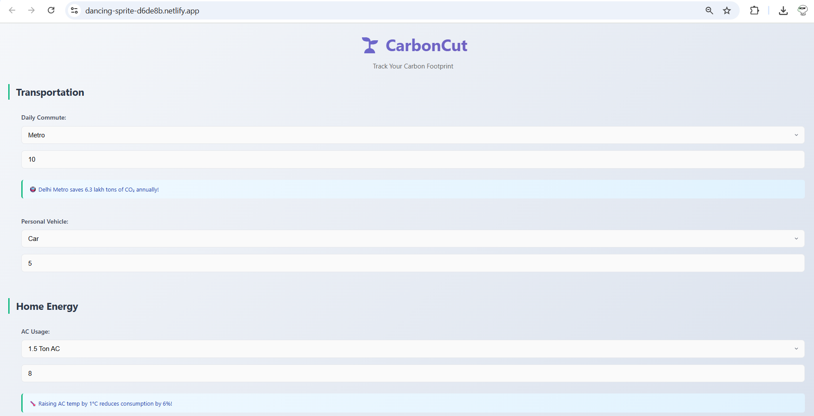
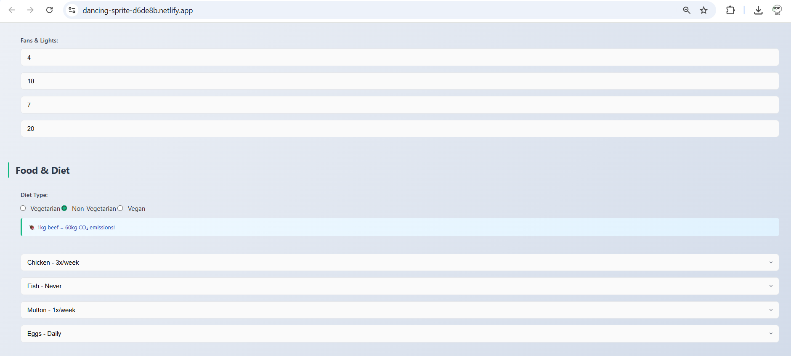
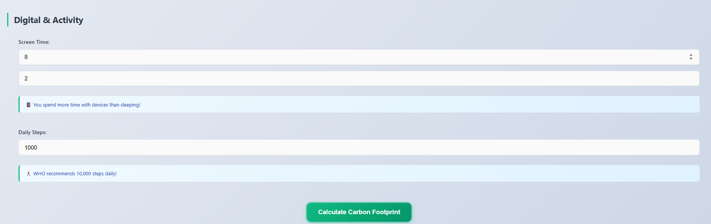
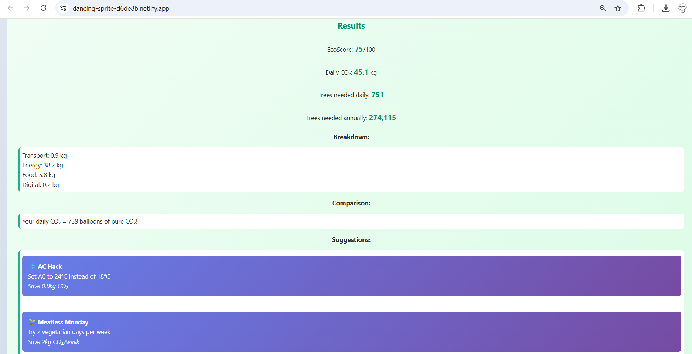

# 🌱 CarbonCut – Track & Reduce Your Carbon Footprint

> Submission for **Code For Bharat – Season 2**  
> Team: **Byte By Bite**  
> Theme: **Sustainable Tech & Climate Innovation**  
> 🌐 Live: [https://dancing-sprite-d6de8b.netlify.app](https://dancing-sprite-d6de8b.netlify.app)

Team Members: Rajat Gupta, Animesh Sharma, Shiv Sharma, Ayush Kumar

---

CarbonCut is a carbon footprint tracking web app tailored for the Indian lifestyle. It empowers users—especially urban youth—to calculate their daily carbon emissions based on transport, energy, food, and digital habits. The app gives a clear EcoScore, tree offset estimates, and actionable suggestions to reduce impact.

---

## 📸 Screenshots

### Dashboard Screens

| Dashboard 1 | Dashboard 2 | Dashboard 3 |
|-------------|-------------|-------------|
|  |  |  |

### Result Screen

| Result |
|--------|
|  |

---

## 🔍 Key Features

- Tailored for Indian lifestyle (Metro, LPG, Dal, Veg/Non-Veg)
- Calculates CO₂ emissions from transport, electricity, food, and devices
- Estimates trees required for daily and annual offset
- Generates EcoScore and personalized suggestions
- Anonymous data logging using Supabase Edge Functions

---

## Tech Stack

- HTML, CSS, JavaScript
- Supabase Edge Functions (Deno)
- Supabase PostgreSQL
- Netlify (Frontend Hosting)

---
## 📁 File Structure

├──index.html
├──style.css
├──script.js
├──index.ts
├──README.md
├──dashboard1.png
├──dashboard2.png
├──dashboard3.png
├──result.png

## 📡 API Endpoint

### `POST /calculate`

Stores user footprint data and returns emissions summary.

#### Example Request

{
  "user_session_id": "abc123",
  "timestamp": "2025-07-12T18:00:00Z",
  "ip_address": "192.168.1.1",

  "commute_mode": "metro",
  "commute_distance": 8.5,
  "personal_vehicle_type": "none",
  "personal_vehicle_distance": 0,

  "ac_type": "ac_1ton",
  "ac_hours": 3,
  "fan_count": 2,
  "fan_hours": 5,
  "light_count": 4,
  "light_hours": 6,

  "diet_type": "vegetarian",
  "dal_frequency": 7,
  "rice_frequency": 7,
  "vegetables_frequency": 14,
  "dairy_frequency": 7,
  "chicken_frequency": 0,
  "fish_frequency": 0,
  "mutton_frequency": 0,
  "eggs_frequency": 0,
  "vegan_proteins_frequency": 0,
  "plant_milk_frequency": 0,

  "phone_hours": 4,
  "laptop_hours": 6,
  "daily_steps": 7500,

  "total_emissions": 4.2,
  "transport_emissions": 1.3,
  "energy_emissions": 1.4,
  "food_emissions": 1.0,
  "digital_emissions": 0.5,
  "eco_score": 67,
  "trees_daily": 58,
  "trees_annual": 21170
}

#### Example Response

{
  "success": true,
  "data": {
    "id": 123,
    "total_emissions": 4.2,
    "eco_score": 67,
    "timestamp": "2025-07-12T18:00:00Z"
  },
  "message": "Calculation saved successfully"
}

---

